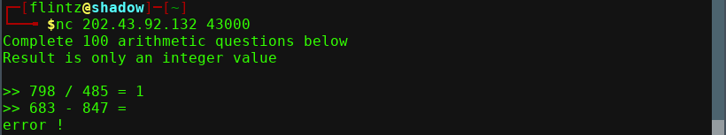

# Aritmatika

diberikan sebuah koneksi nc 202.43.92.132 43000 <br>
dilihat program meminta melakukan operasi hitung sebanyak 100x<br>



disini saya mencoba script pada https://codingo.io/ctf/writeup/programming/crikeycon/2017/03/08/crikeycon-2017-fastmath.html<br>
yang memiliki kemiripan pada soal ini.

disini saya ubah nilai regex tersebut berdasarkan string yang ditangkap pada nc nc 202.43.92.132 43000 <br>
Complete 100 arithmetic questions below\nResult is only an integer value\n\n>> <br>

```
 match = re.search('(\d+)(?:\s*)([\+\-\*\/])(?:\s*)(\d+)', decoded)

```
<br>
berikut script

```
#!/usr/bin/python3
 
import socket
import re
import operator


MAXBUF = 4096
SENTINEL = 'ASGama'
CTF_BOT = ('202.43.92.132', 43000)


if __name__ == '__main__':
    client = socket.socket(socket.AF_INET, socket.SOCK_STREAM)
    client.connect(CTF_BOT)
 
    while True:
        data = b''

        # receive and store data
        while True:
            chunk = client.recv(MAXBUF)
            data += chunk
            if len(chunk) < MAXBUF:
                break
        
        # store decoded data for future usage
        decoded = data.decode('utf-8')
        
        # print out response packet
        print(decoded)

        # our flag contains flag{}, once it's revealed print recevied data and exit
        if SENTINEL in decoded:
            print(decoded)
            break

        # bot sends the last answer back as x=x to confirm, skip this itteration
        if not re.search('[-+/*]', decoded):
            continue

        match = re.search('(\d+)(?:\s*)([\+\-\*\/])(?:\s*)(\d+)', decoded)

        if not match:
            raise ValueError("Invalid expression string")
        
        expression = match.group(0)
 
        # properly handle division
        if '/' in expression:
            expression = expression.replace('/', '//')
 
        result = eval(expression)
 
        # print results to screen to see script progress
        print(expression + ' = ' + str(result))

        # encode and transfer
        data = str(result).encode('utf-8') + b'\n'
        print('Sending: ' + str(result))
        client.send(data)

```


jalankan dan flag didapat<br>

**ASGama{g3nius_pl4yer}**
<br>

disini saya juga mencoba script lain menggunakan pwntools namun gagal <br>

```
#!/usr/bin/python

from pwn import *

r = remote('202.43.92.132', 43000)

r.recv()

while 1:
	hasil = r.recv()
	print hasil
	hasil = hasil.split()
	angka1 = int(hasil[1])
	operator = hasil[2]
	angka2 = int(hasil[3])
	print angka1, operator, angka2
	if operator == '+':
		temp = angka1 + angka2
	elif operator == '-':
		temp = angka1 - angka2
	elif operator == '*':
		temp = angka1 * angka2
	else:
		temp = angka1 / angka2
	print temp
	r.sendline(str(temp))
	print r.recv()


```
