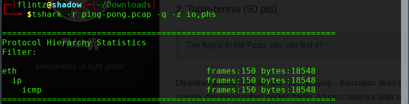
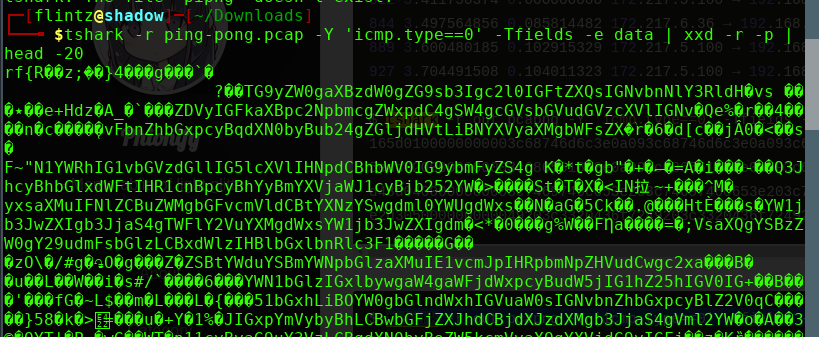
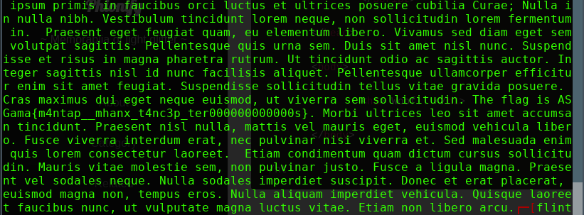

# Ping-Pong


dilakukan analysis menggunakan tshark untuk mengetahui statistik dari keseluruhan packet frame<br>

``` tshark -r ping-pong.pcap -q -z io,phs ``` <br>

<br>

kemudian dilakukan pengecekan terhadap data section untuk protocol icmp <br>

```  tshark -r ping-pong.pcap -Y icmp -Tfields -e data | tr -d '[:space:]' | wc ``` <br>

<br>
ditemukan data section sepanjang 4416 bytes pada ICMP streams<br>


``` tshark -r ping-pong.pcap -Y 'icmp.type==0' -Tfields -e data | xxd -r -p | head -20 ``` <br>
<br>
terlihat banyak base64, Setelah beberapa percobaan dilakukan pengambilan diakhir base64 tersebut berisi flagnya
``` tshark -r ping-pong.pcap -Y 'icmp.type==0' -Tfields -e data | cut -c65- | xxd -r -p | base64 -d ```<br>

<br>

** ASGama{m4ntap__mhanx_t4nc3p_ter000000000000s} **

