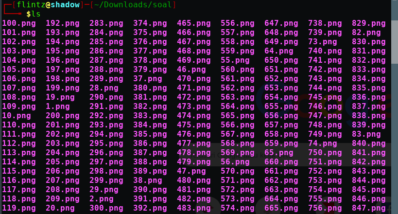
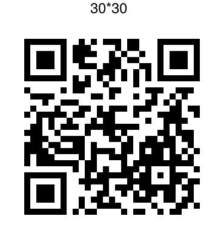

# kode

diberikan file zip berisi potongan gambar yang diduga sebuah qr code




berikut script yang dicoba

```
from PIL import Image


def parse(filename):
	im = Image.open(filename)
	return im.getpixel((10,10))


def main():
	tupl = map(lambda x : parse('%s.png'%(x)), range(1,901))
	im   = Image.new('RGB',(30,30))
	im.putdata(tupl)
	im.resize((300,300)).save('flag_qr.png')
	
if __name__ == '__main__':
	main()

```
namun hasil qr tidak bisa di decode <br>
setelah searching https://medium.com/@the.bilal.rizwan/intigriti-ctf-writeup-737009900a42 <br>
didapat tools linux yaitu montage yang dapat menggabungkan potongan dari gambar tersebut<br>

``` montage -mode concatenate -title 30x30 $(ls -v *) qr.png ``` <br>
didapat lah qr berisi flag tersebut<br>



**ASGama{RRQ_C0D3_not_Qrc0D3}**


```
import requests
import re

url = 'https://zxing.org/w/decode'
files = {'f': open('qr.jpg', 'rb')}
req = requests.post(url, files=files)
flag = re.search(r'<pre>(.*?)<\/pre>', req.content).group(1)

print "Flag: " + flag

```

script lain<br>

```
from PIL import Image
import requests
import re

im = Image.new("RGB", (30,30), 'white')
px = im.load()
y =0
x = 0
i = 1

while y< 30:
	for x in range(0,30):
		fn = str(i) + ".png"
		jm = Image.open(fn)
		qx = jm.load()
		px[x,y] = qx[1,1]
		i += 1
		if x == 29:
			y += 1

im.resize((300,300)).save('flag.png')
```
