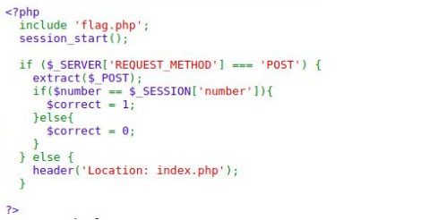

<br>

Dari source code tersebut, terdapat extract() yang
mempunyai kelemahan value overwrite jika implementasinya salah.
Lalu karena ada validasi bahwa variable $number harus sama
valuenya dengan $_SESSION[‘number’], dengan memanfaatkan
kelemahan extract() tersebut kita bisa mengubah value yang
tadinya random menjadi tidak random. Disini kami menggunakan
software CLI cURL.<br>

``` curl --data "number=1&_SESSION=1" http://18.222.179.254:10013/test.php ``` <br>