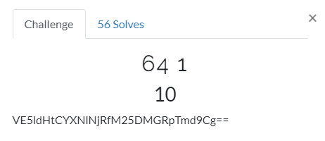
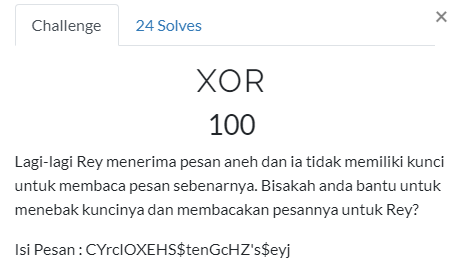

## Putar Tiga Belas

Didapat chiper ROT13 coba decode didapat flag Tnet{}

## 64 1

didapat base64, decode saja flag 

## 64 2

didapat lagi base64 yg berulang, agar simple kita buat loopnya 

flag
## XOR

sesuai judul coba kita bruteforce pada single XORnya

jalankan dan flag { }
