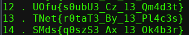
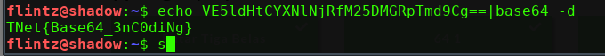
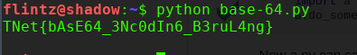
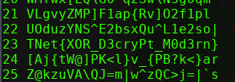

## Putar Tiga Belas

Didapat sebuah chiper ROT13 coba decode didapat 

didapat base64, langsung decode saja

didapat lagi base64 yg berulang, agar simple kita pake script ini simpan string base64 pada flag.txt
'''
import base64

f = open('flag.txt', 'r')
hasil = f.read()

while True:
  hasil = base64.b64decode(hasil).decode('utf-8')

  if '{' in hasil:
    print(hasil)
    break

'''

flag **TNet{bAsE64_3Nc0dIn6_B3ruL4ng}**
## XOR

sesuai judul coba kita bruteforce pada single XORnya

flag **TNet{XOR_D3cryPt_M0d3rn}**
