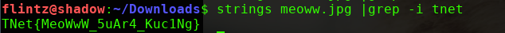
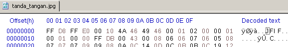
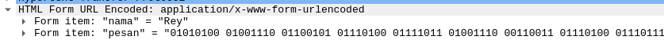

## Meowing 2

diberikan sebuah gambar nekovoi lagi, cek gambar tsb dengan gabungan antara strings dan grep untuk mencari string 'tnet'

flag **TNet{MeoWwW_5uAr4_Kuc1Ng}**

## Tanda Tangan

didapat sebuah file yang diduga merupakan sebuah file gambar, cek dengan hex editor dan memang file signature tsb salah.

**TNet{H3adeR_Si6Natur3_FiL3}**

## Kode Tiket

diberikan sebuah file pcapng, buka dengan wireshark. pada POST /upload.html didapat sebuah biner.

decode didapat flag **TNet{N3tw0rk_F0r3nSic}**

