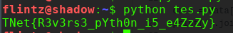
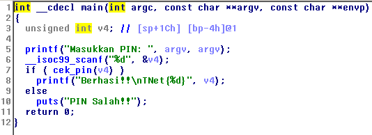
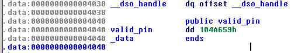
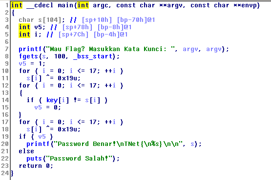
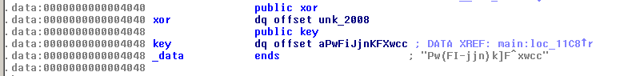
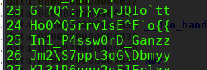
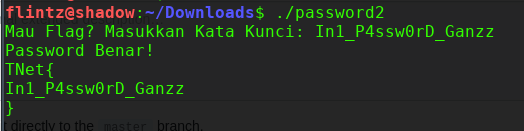

## Password
<p  align="center"></p>
diberikan sebuah file soal reverse, coba dulu dengan strings didapat key yang diduga sebuah flag


flag **TNet{M1nt4_Fl4gnY4_D0nK}**

## Tebak Kata 2
<p  align="center"></p>
didapat sebuah file py yg berisi script python


dari situ terlihat jika flag sudah ada namun terpecah, dan tinggal menyusunnya
berikut solver yang saya coba sendiri

```
data =[None] *30
data[::5] = 'TRstiZ'
data[15:-7] = 'th0n_i5_'
data[6::2] = '33s_Yhni_4zy'
data[8:15] = '3rs3_pY'
data[::-7] = '}_t3N'
data[2::5] = 'ev_0_Z'
data[23] = 'e'
data[-29:-25]  = 'Net{'

data = data[30:] +data[:30]
print(''.join(data))

```
jalankan...


flag **TNet{R3v3rs3_pYth0n_i5_e4ZzZy}**

## PIN
<p  align="center"></p>
diberikan sebuah binary ELF64 buka file tsb dengan IDA pro

didapat sebuah fungsi pengecekan pin, cek pada fungsi valid_pin

didapat sebuah string hexa yg merupakan pin valid, ubah kedesimal menjadi 17081945 
, inputkan pin tsb


flag **TNet{17081945}**

## Password 2
<p  align="center"></p>
diberikan sebuah binary ELF64 buka file tsb dengan IDA pro

dilakukan pengecekan inputan variabel s harus sama dengan key agar v5 tetap bernilai true
cek pada fungsi key tsb didapat sebuah key yang sudah di XOR,

 bruteforce key tersebut didapat string ini
 
 
 ketika di run..
 
 
 
 flag **TNet{In1_P4ssw0rD_Ganzz}**

