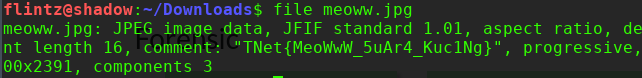
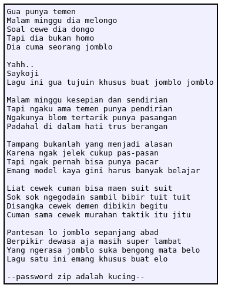
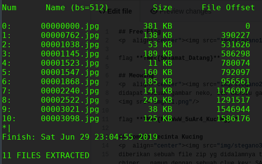

## Free Flag

flag **TNet{Selamat_Datang}**

## Meowing

didapat sebuah gambar neko, cek dahulu gambar tsb dengan 'file'

flag **TNet{MeoWwW_5uAr4_Kuc1Ng}**

## Jomblo Pecinta Kucing

diberikan sebuah file zip yg didalamnya terdapat sebuah file password.txt berupa sebuah string yang saya kira awalnya subtitusi chiper , namun dengan sebuah clue key: SAYKOJI string tsb merupakan vigener chiper 

extract file zip tersebut, didapat sebuah file flag.jpg
coba dengan foremost untuk mengextract file gambar tersebut, flag terdapat pada salah satu gambar nekopoi tsb

flag **TNet{Kuc1N6_y4n6_Im03t}**
