## Felis Catus

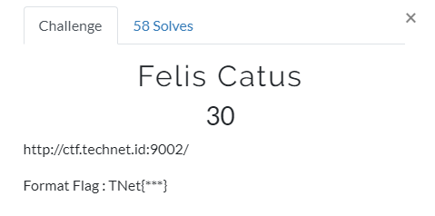

didapat link tentang SQL injection, coba view page source terdapat md5 hash
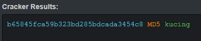

didapat flag **TNet{kucing}**

## Login

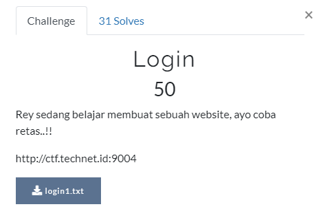

didapat form login ini
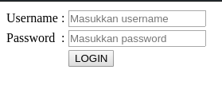
mencoba dengan berbagai SQL injection namun gagal semua

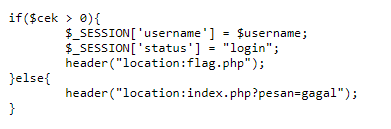
 akhirnya coba dengan curl pada flag.php curl -i http://ctf.technet.id:9004/flag.php
didapat 
  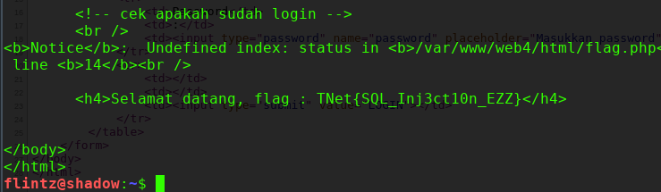
  
 flag **TNet{SQL_Inj3ct10n_EZZ}**
 
 thx to gayu n rizky
 
## Tebak Kata

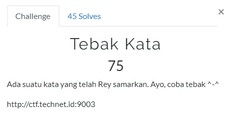

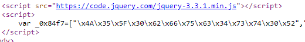
terdapat form berupa inputan text, coba view page source dan didapat hex 
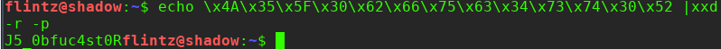

flag **TNet{J5_0bfuc4st0R}**

## Login 2

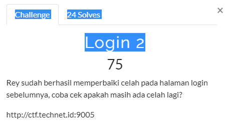

sama seperti soal Login pertama dengan curl
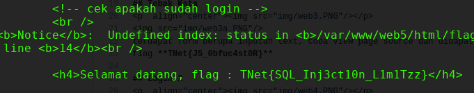

flag **TNet{SQL_Inj3ct10n_L1m1Tzz}**

## Kepala Saya Dimana?

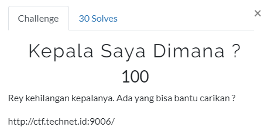

sesuai clue cek pada header terdapat sebuah chipertext
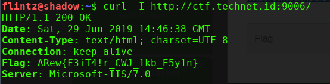
cek juga pada page source didapat key berupa HEADER

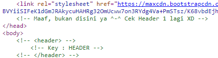
langsung cus decrypt dengan vigener chiper
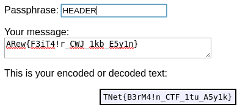

flag 
**TNet{B3rM4!n_CTF_1tu_A5y1k}**

## Javascript Membingungkan

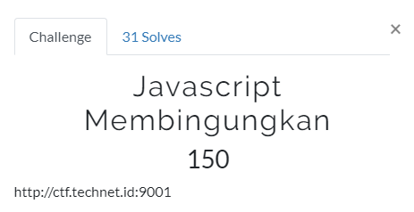

lihat page sourcenya terdapat file js.txt
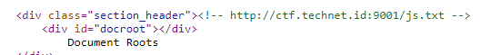
didapat string berupa jsfuck dan decode di http://codertab.com/JsUnFuck
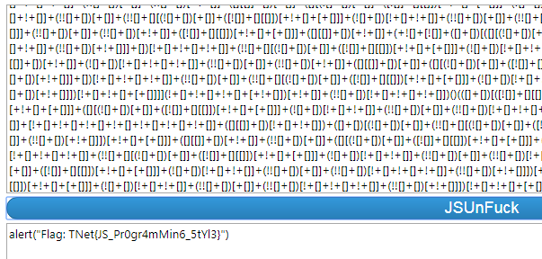

flag **TNet{JS_Pr0gr4mMin6_5tYl3}**

