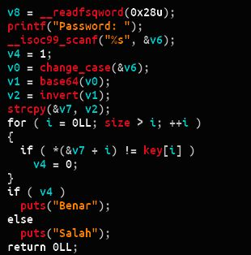

# Works Works Works

Input kita pertama di-? xor ? dengan 32, kemudian dilakukan ? base64 ? (terlihat jelas dari charset yang digunakan, dan merupakan implementasi standar tanpa charset yang diputar-putar), dan terakhir ditambah dengan 128 (bisa dibilang operasi bitwise NOT). Setelah itu baru string input kita dibandingkan dengan global variable ? key sepanjang ? size
<br>

<br>

```

    #!/usr/bin/python
    from base64 import b64decode as d
    # throw the 'ff's since it's in char range
    # taken from 0x602080
    flag_enc_inv = [
            0xd9,0xb2,0xb9,0xf4,
            0xe3,0xc7,0xda,0xec,
            0xe3,0xb3,0xd1,0xd2,
            0xc5,0xd6,0xf4,0xd9,
            0xd4,0xb1,0xc9,0xd4,
            0xc5,0xee,0xb9,0xc3,
            0xd1,0xd6,0xce,0xc6,
            0xc6,0xe8,0xd2,0xaf,
            0xd5,0xb0,0xe8,0xca,
            0xd2,0xec,0xd1,0xd2,
            0xc5,0xe8,0xe8,0xe4,
    ]
    flag_enc = ""

    # invert & keep it at char's size
    for i in xrange(len(flag_enc_inv)):
            flag_enc += chr((flag_enc_inv[i]-0x80) & 0xff)
    # decode b64
    flag_xor = d(flag_enc)
    # xor with 0x20
    flag = ""
    for i in xrange(len(flag_xor)):
            flag += chr(ord(flag_xor[i])^0x20)

    print flag

```
<br>

**COMPFEST11{xor32_base64_shift128}**

