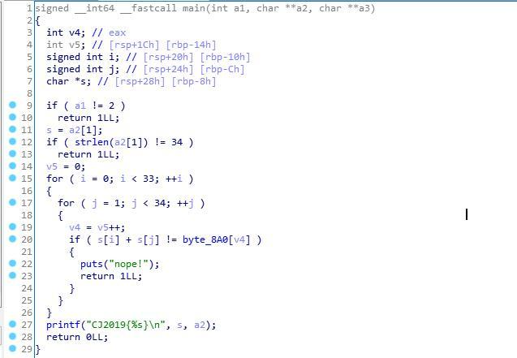
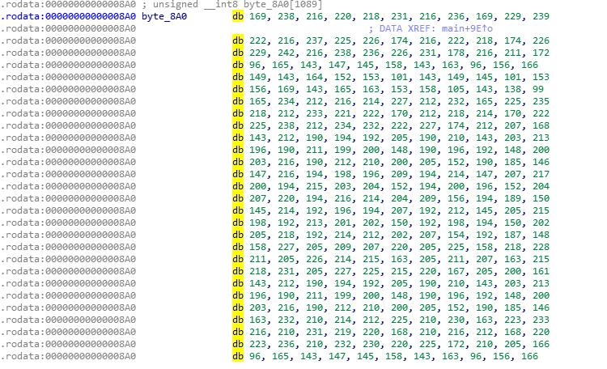
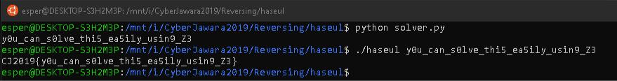

# haseul

Diberikan sebuah program ELF 64-bit, langsung saja decompile menggunakan ida pro.<br>


Bisa dilihat, program menerima inputan dari argv dan melakukan pengecekan disitu. Langsung lihat nilai dari byte_8A0 yang merupakan variabel pembanding. (Kepotong karena terlalu panjang)<br>


Langsung saja buat constraint solvernya menggunakan z3. Berikut scriptnya.<br>

```
lis = [169, 238, 216, 220, 218, 231, 216, 236, 169, 229, 239 ,222, 216, 237, 225, 226, 174, 216, 222, 218, 174, 226 ,229, 242, 216, 238, 236, 226, 231, 178, 216, 211, 172 ,96, 165, 143, 147, 145, 158, 143, 163, 96, 156, 166 ,149, 143, 164, 152, 153, 101, 143, 149, 145, 101, 153 ,156, 169, 143, 165, 163, 153, 158, 105, 143, 138, 99 ,165, 234, 212, 216, 214, 227, 212, 232, 165, 225, 235 ,218, 212, 233, 221, 222, 170, 212, 218, 214, 170, 222 ,225, 238, 212, 234, 232, 222, 227, 174, 212, 207, 168 ,143, 212, 190, 194, 192, 205, 190, 210, 143, 203, 213 ,196, 190, 211, 199, 200, 148, 190, 196, 192, 148, 200 ,203, 216, 190, 212, 210, 200, 205, 152, 190, 185, 146 ,147, 216, 194, 198, 196, 209, 194, 214, 147, 207, 217 ,200, 194, 215, 203, 204, 152, 194, 200, 196, 152, 204 ,207, 220, 194, 216, 214, 204, 209, 156, 194, 189, 150 ,145, 214, 192, 196, 194, 207, 192, 212, 145, 205, 215 ,198, 192, 213, 201, 202, 150, 192, 198, 194, 150, 202 ,205, 218, 192, 214, 212, 202, 207, 154, 192, 187, 148 ,158, 227, 205, 209, 207, 220, 205, 225, 158, 218, 228 ,211, 205, 226, 214, 215, 163, 205, 211, 207, 163, 215 ,218, 231, 205, 227, 225, 215, 220, 167, 205, 200, 161 ,143, 212, 190, 194, 192, 205, 190, 210, 143, 203, 213 ,196, 190, 211, 199, 200, 148, 190, 196, 192, 148, 200 ,203, 216, 190, 212, 210, 200, 205, 152, 190, 185, 146 ,163, 232, 210, 214, 212, 225, 210, 230, 163, 223, 233 ,216, 210, 231, 219, 220, 168, 210, 216, 212, 168, 220 ,223, 236, 210, 232, 230, 220, 225, 172, 210, 205, 166 ,96, 165, 143, 147, 145, 158, 143, 163, 96, 156, 166 ,149, 143, 164, 152, 153, 101, 143, 149, 145, 101, 153 ,156, 169, 143, 165, 163, 153, 158, 105, 143, 138, 99 ,156, 225, 203, 207, 205, 218, 203, 223, 156, 216, 226 ,209, 203, 224, 212, 213, 161, 203, 209, 205, 161, 213 ,216, 229, 203, 225, 223, 213, 218, 165, 203, 198, 159 ,166, 235, 213, 217, 215, 228, 213, 233, 166, 226, 236 ,219, 213, 234, 222, 223, 171, 213, 219, 215, 171, 223 ,226, 239, 213, 235, 233, 223, 228, 175, 213, 208, 169 ,149, 218, 196, 200, 198, 211, 196, 216, 149, 209, 219

,202, 196, 217, 205, 206, 154, 196, 202, 198, 154, 206 ,209, 222, 196, 218, 216, 206, 211, 158, 196, 191, 152 ,143, 212, 190, 194, 192, 205, 190, 210, 143, 203, 213 ,196, 190, 211, 199, 200, 148, 190, 196, 192, 148, 200 ,203, 216, 190, 212, 210, 200, 205, 152, 190, 185, 146 ,164, 233, 211, 215, 213, 226, 211, 231, 164, 224, 234 ,217, 211, 232, 220, 221, 169, 211, 217, 213, 169, 221 ,224, 237, 211, 233, 231, 221, 226, 173, 211, 206, 167 ,152, 221, 199, 203, 201, 214, 199, 219, 152, 212, 222 ,205, 199, 220, 208, 209, 157, 199, 205, 201, 157, 209 ,212, 225, 199, 221, 219, 209, 214, 161, 199, 194, 155 ,153, 222, 200, 204, 202, 215, 200, 220, 153, 213, 223 ,206, 200, 221, 209, 210, 158, 200, 206, 202, 158, 210 ,213, 226, 200, 222, 220, 210, 215, 162, 200, 195, 156 ,101, 170, 148, 152, 150, 163, 148, 168, 101, 161, 171 ,154, 148, 169, 157, 158, 106, 148, 154, 150, 106, 158 ,161, 174, 148, 170, 168, 158, 163, 110, 148, 143, 104 ,143, 212, 190, 194, 192, 205, 190, 210, 143, 203, 213 ,196, 190, 211, 199, 200, 148, 190, 196, 192, 148, 200 ,203, 216, 190, 212, 210, 200, 205, 152, 190, 185, 146 ,149, 218, 196, 200, 198, 211, 196, 216, 149, 209, 219 ,202, 196, 217, 205, 206, 154, 196, 202, 198, 154, 206 ,209, 222, 196, 218, 216, 206, 211, 158, 196, 191, 152 ,145, 214, 192, 196, 194, 207, 192, 212, 145, 205, 215 ,198, 192, 213, 201, 202, 150, 192, 198, 194, 150, 202 ,205, 218, 192, 214, 212, 202, 207, 154, 192, 187, 148 ,101, 170, 148, 152, 150, 163, 148, 168, 101, 161, 171 ,154, 148, 169, 157, 158, 106, 148, 154, 150, 106, 158 ,161, 174, 148, 170, 168, 158, 163, 110, 148, 143, 104 ,153, 222, 200, 204, 202, 215, 200, 220, 153, 213, 223 ,206, 200, 221, 209, 210, 158, 200, 206, 202, 158, 210 ,213, 226, 200, 222, 220, 210, 215, 162, 200, 195, 156,156 ,225, 203, 207, 205, 218, 203, 223, 156, 216, 226, 209 ,203, 224, 212, 213, 161, 203, 209, 205, 161, 213, 216 ,229, 203, 225, 223, 213, 218, 165, 203, 198, 159, 169 ,238, 216, 220, 218, 231, 216, 236, 169, 229, 239, 222 ,216, 237, 225, 226, 174, 216, 222, 218, 174, 226, 229 ,242, 216, 238, 236, 226, 231, 178, 216, 211, 172, 143

,212, 190, 194, 192, 205, 190, 210, 143, 203, 213, 196 ,190, 211, 199, 200, 148, 190, 196, 192, 148, 200, 203 ,216, 190, 212, 210, 200, 205, 152, 190, 185, 146, 165 ,234, 212, 216, 214, 227, 212, 232, 165, 225, 235, 218 ,212, 233, 221, 222, 170, 212, 218, 214, 170, 222, 225 ,238, 212, 234, 232, 222, 227, 174, 212, 207, 168, 163 ,232, 210, 214, 212, 225, 210, 230, 163, 223, 233, 216 ,210, 231, 219, 220, 168, 210, 216, 212, 168, 220, 223 ,236, 210, 232, 230, 220, 225, 172, 210, 205, 166, 153 ,222, 200, 204, 202, 215, 200, 220, 153, 213, 223, 206 ,200, 221, 209, 210, 158, 200, 206, 202, 158, 210, 213 ,226, 200, 222, 220, 210, 215, 162, 200, 195, 156, 158 ,227, 205, 209, 207, 220, 205, 225, 158, 218, 228, 211 ,205, 226, 214, 215, 163, 205, 211, 207, 163, 215, 218 ,231, 205, 227, 225, 215, 220, 167, 205, 200, 161, 105 ,174, 152, 156, 154, 167, 152, 172, 105, 165, 175, 158 ,152, 173, 161, 162, 110, 152, 158, 154, 110, 162, 165 ,178, 152, 174, 172, 162, 167, 114, 152, 147, 108, 143 ,212, 190, 194, 192, 205, 190, 210, 143, 203, 213, 196 ,190, 211, 199, 200, 148, 190, 196, 192, 148, 200, 203 ,216, 190, 212, 210, 200, 205, 152, 190, 185, 146, 138 ,207, 185, 189, 187, 200, 185, 205, 138, 198, 208, 191 ,185, 206, 194, 195, 143, 185, 191, 187, 143, 195, 198 ,211, 185, 207, 205, 195, 200, 147, 185, 180, 141]

from z3 import *


data = [BitVec('x{}'.format(x), 32) for x in range(34)]


s = Solver()

for i in range(len(data)): #printable range 0x20 - 0x7f atau (32-127)

s.add(data[i] >= 0x20)

s.add(data[i] < 0x7f)


v5 = 0

for i in range(33):

for j in range(1,34):

s.add((data[i] + data[j]) == lis[v5])

v5 = v5+1


if s.check() == z3.sat:

model = s.model()

solution = ''.join([chr(int(str(model[data[i]]))) for i in range(34)])

print solution
```

Hasilnya adalah y0u_can_s0lve_thi5_ea5ily_usin9_Z3

Jika dimasukkan ke dalam program hasilnya sebagai berikut.<br>


