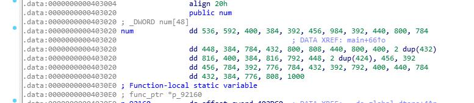
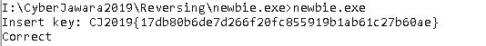

# newbie.exe

Diberikan sebuah file PE 64-bit yang melakukan pengecekan masukkan, dan
masukkan tersebut merupakan flag. Berikut hasil decompile menggunakan ida pro
<br>


Bisa dilihat pengecekkan jika nilai setiap karakter dimasukkan dikalikan 8, sama dengan nilai dari variabel num. Berikut nilai dari variabel num.<br>


Langsung saja buat script python untuk otomatis menghitung nilai masukkannya, dengan cara setiap nilai num dibagi 8.<br>

```
lis = [536, 592, 400, 384, 392, 456, 984, 392, 440, 800, 784, 448, 384, 784, 432, 800, 808, 440, 800, 400, 432, 432, 816, 400, 384, 816, 792, 448, 424, 424, 456, 392, 456, 784, 392, 776, 784, 432, 392, 792, 400, 440, 784, 432, 384, 776, 808, 1000]

print "".join(chr(i/8) for i in lis)
```

Hasilnya CJ2019{17db80b6de7d266f20fc855919b1ab61c27b60ae} Jika dimasukkan ke program, akan muncul tulisan correct<br>



