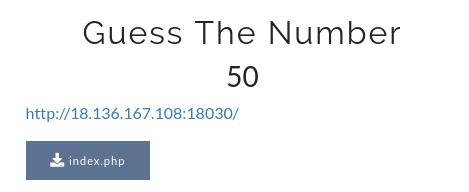
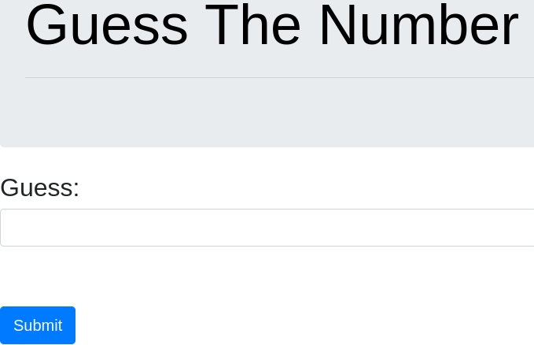
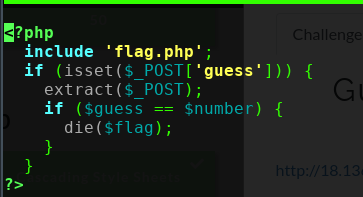
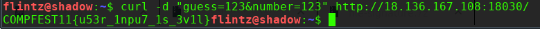

# Guess The Number

didapat link sebuah web > http://18.136.167.108:18030/  dan file index.php
dimana web tsb meminta sebuah inputan,

buka file index.php tersebut,
diketahui dilakukan pengecekan apabila pada $guess sama dengan $number akan menghasilkan flag.

berarti apapun bisa dimasukan asal valuenya sama.
disini saya coba dengan curl untuk melakukan post data tsb

> curl -d "guess=123&number=123" http://18.136.167.108:18030/

**COMPFEST11{u53r_1npu7_1s_3v1l}**
