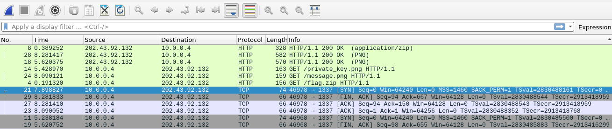
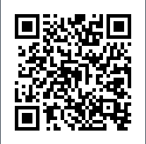
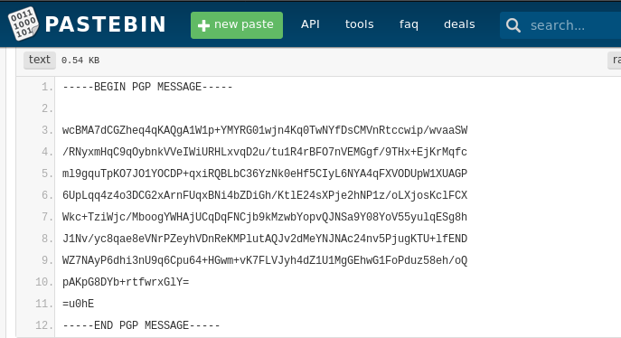
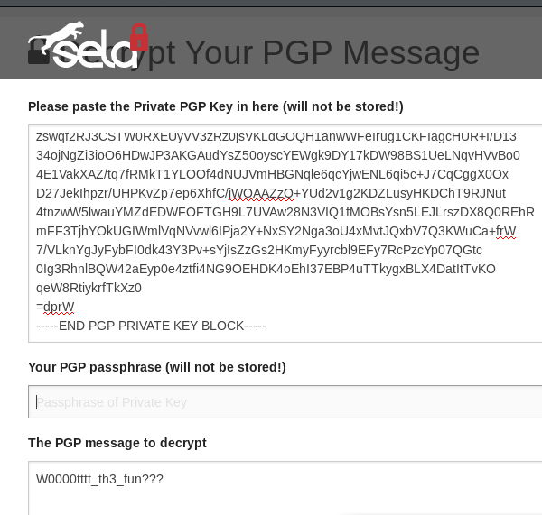
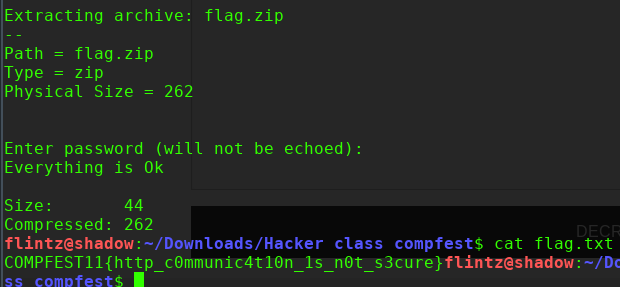

# Secret message

diberikan sebuah file capture traffic pada sebuah website ,
diketahui didalamnya terdapat file png dan zip. 

lakukan ekstrak file dengan cara Export HTTP object dan didapatlah message .png, private_key png, dan flag.zip

gambar merupakan sebuah qr code, decode keduanya pada web https://zxing.org/w/decode.jspx 

hasil decode didapat sebuah link menuju pastebin yang berisi sebuah message dan private key,

diketahui bahwa enkripsi tersebut merupakan PGP encryption

disini saya coba menggunakan tools PGP decrypter online pada https://sela.io/pgp/ .
masukan PGP message dan private keynya. 

didapatlah password untuk membuka file flag.zip tadi

**COMPFEST11{http_c0mmunic4t10n_1s_n0t_s3cure}**
