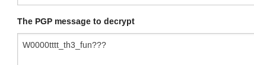

# Secret message

diberikan sebuah file capture traffic pada sebuah website 
diketahui didalamnya terdapat file png dan zip. 

lakukan ekstrak file dengan cara Export HTTP object dan didapatlah message .png, private_key png, dan flag.zip

gambar merupakan sebuah qr code, decode keduanya pada web https://zxing.org/w/decode.jspx didapat sebuah link menuju pastebin 

Didapat sebuah message dan private key yang diketahui bahwa enkripsi tersebut merupakan PGP

disini saya coba menggunakan tools PGP decrypter online pada https://sela.io/pgp/ dan masukan 

