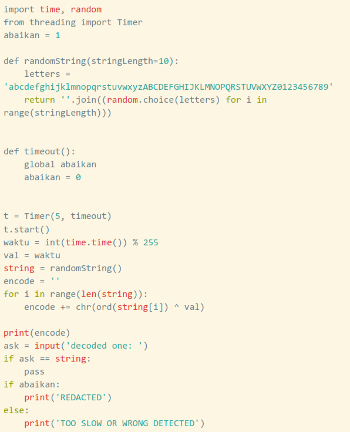

# Demi masa

<br>
```
from pwn import *

import time
r=remote('34.87.0.60', 2057)
waktu= int(time.time()) % 255 
x = r.recvline().strip()


ans = ""
for i in range(len(x)):
	ans += chr(ord(x[i]) ^ waktu)
print ans
r.sendline(ans)
r.interactive()

```
<br>

```
import time, random

from threading import Timer

from pwn import *

r = remote('34.87.0.60', 2057)

waktu = int(time.time()) % 255

val = waktu

data = r.recvline()[:-1]

m = ''

for i in data:

   m += chr(ord(i) ^ val)

r.sendlineafter('one:', m)

print r.recv()

r.interactive()
```