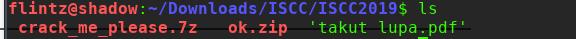
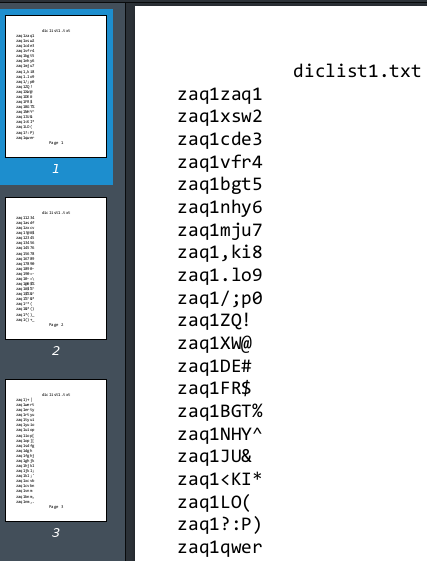
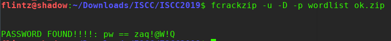
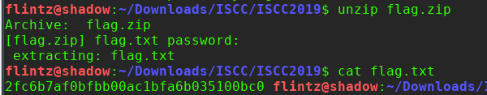
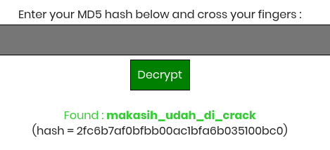

# Crack me please

didapat sebuah file 7z yang didalamnya terdapat file ok.zip dan takutlupa.pdf

saat dicoba diekstrak, file ok.zip tsb diberi proteksi password,
dimana password didapat dari isi takutlupa.pdf

disini bisa diketahui untuk melakukan bruteforce file ok.zip dari semua dictionary yg didapat dari file pdf tsb.
copy semua dictionary tersebut dan masukan dalam sebuah text utk dijadikan sebuah wordlist.

disini saya memakai fcrackzip untuk melakukan brute attack dengan wordlist tadi
> fcrackzip -u -D -p wordlist ok.zip

dan didapat password berikut

ekstrak dan didapat sebuah file zip lagi dan hai.png. 
dan ternyata lagi lagi zip tsb diberi password dan wordlist yg didapat dari gambar tersebut.
lakukan kembali brute dengan dengan konversi dulu file gambar  kedalam format string

dan akhirnya didapat lah flag.txt..
yang didalamnya terdapat sebuah md5 hash

 decrypt hash tsb di dapat flagnya
 
 

**ISCC2019{makasih_udah_di_crack}**

