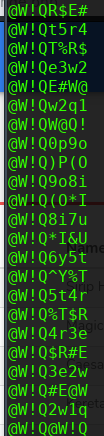

# Crack me please

didapat sebuah file 7zip https://drive.google.com/file/d/1EBlC29ZosqhigV7emsHNsfn7PfLpzT4K/view yang saat diekstrak didalamnya terdapat file ok.zip dan takutlupa.pdf

saat dicoba diekstrak, file ok.zip tsb diberi proteksi.,
dimana password didapat dari isi takutlupa.pdf tadi

disini bisa diketahui untuk melakukan bruteforce file ok.zip dari semua list dictionary yg didapat dari isi pdf tsb.
copy semua dictionary tersebut dan masukan dalam sebuah text utk dijadikan sebuah wordlist.

disini saya memakai fcrackzip untuk melakukan brute attack dengan wordlist tadi
> fcrackzip -u -D -p wordlist ok.zip

dan didapatlah password berikut

saat diekstrak didapat sebuah file flag.zip dan hai.png. 
dan ternyata lagi lagi zip tsb diberi password, dimana password didapat dari strings gambar hai.png tersebut.

lakukan kembali brute dengan dengan konversi dulu file gambar kedalam format string

coba ekstrak kembali dan akhirnya didapat lah flag.txt..
yang didalamnya terdapat sebuah md5 hash

 decrypt hash tsb di dapat flagnya
 
 

**ISCC2019{makasih_udah_di_crack}**

