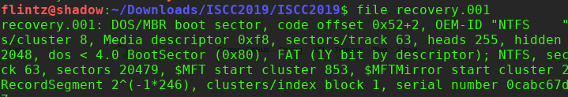
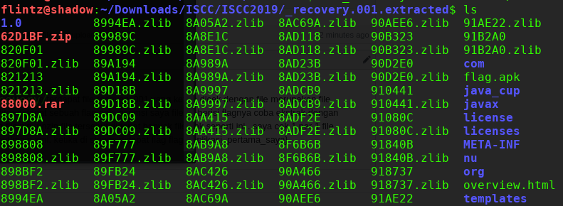
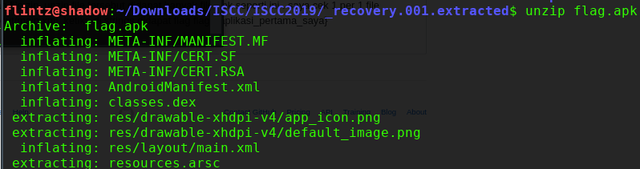
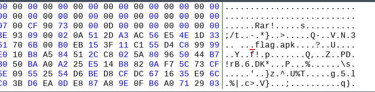

# File Signature 

diberikan sebuah file 7z yang ketika di ekstrak, akan muncul pesan error. 

sesuai judul, clue merupakan file signature yg harus direpair.
saya coba mencocokan header file disini https://en.wikipedia.org/wiki/List_of_file_signatures
dan menggunakan bantuan hex editor untuk mengubah nilainya.

dan ketika di ekstrak, ternyata didalamnya terdapat file zip dan rar yang rusak lagi :v, ubah signature file tsb.
dan menghasilkan potongan flag yg terpecah seperti ini sebanyak 10

juga didapat hint untuk inputan flag seperti berikut

disini butuh ketelitian karna banyak file signature pada gambar png maupun jpg yang salah dan juga jebakan misalnya 
pada flag.html flag.exe flag.mp4 dimana file tersebut merupakan file image,

kumpulkan pecahan flag tersebut spt ini 

dan flag

**ISCC2019{log2222_c3nt3r_br0ws3_k3m4ng_k0m1k_h4t1_34sy_c3m3n_78_g00d}**
